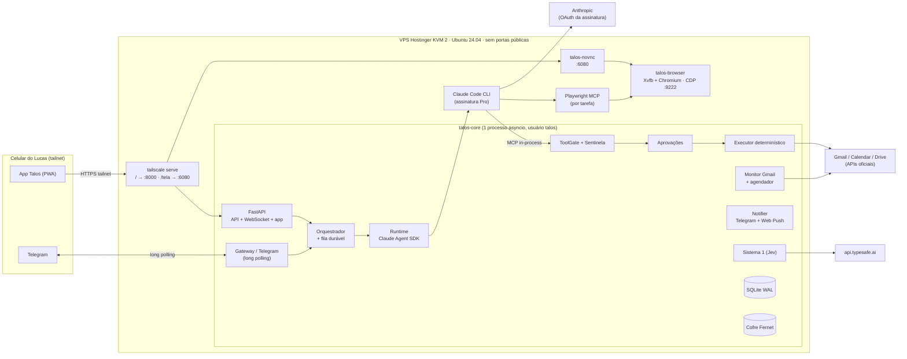
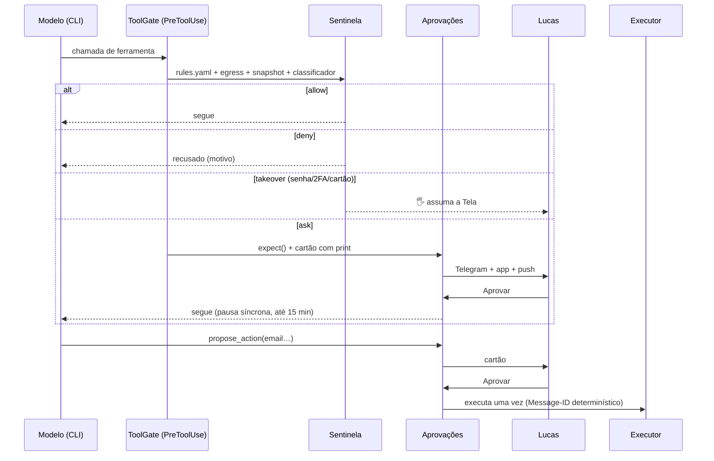

# Arquitetura do Talos

Visão técnica de como o Talos funciona. Os porquês de cada escolha estão nas ADRs, em [DECISIONS.md](DECISIONS.md). A segurança está em [SECURITY.md](SECURITY.md). A operação está no [RUNBOOK.md](RUNBOOK.md).

## 1. Visão geral



Princípios que moldam tudo:
- **Propor ≠ executar.** O modelo só propõe (`propose_action`). Quem executa é o **executor**, código determinístico, uma vez, depois da aprovação.
- **Toda chamada de ferramenta passa pela Sentinela**: allow, ask, deny ou takeover.
- **O modelo nunca vê segredos.** Placeholders `{{dados.*}}` só são resolvidos no executor ou no `vault_fill` aprovado.
- **Nada exposto à internet.** A API e a Tela escutam em `127.0.0.1` e são publicadas só na tailnet, por `tailscale serve`.

## 2. Serviços (systemd)

| Unit | O que roda | Escuta |
|---|---|---|
| `talos-core.service` | `talos run`: API, Telegram, orquestrador, monitor, executor | `127.0.0.1:8000` |
| `talos-browser.service` | Xvfb `:99` + Chromium com perfil persistente (`/var/lib/talos/browser-profile`) | CDP `127.0.0.1:9222` |
| `talos-novnc.service` | x11vnc + noVNC (Tela), com senha VNC | `127.0.0.1:6080` |
| `talos-backup.timer` | `backup.sh` às 03:30 (7 dias de retenção) | — |

Todos rodam como o usuário `talos`, sem sudo, com `NoNewPrivileges` e `ProtectSystem=strict`. O UFW só aceita entrada pela interface `tailscale0`.

## 3. Caminhos no servidor

| Caminho | Conteúdo |
|---|---|
| `/root/talos` | Checkout do Git (onde se faz `git pull`) |
| `/opt/talos` | Cópia instalada pelo `deploy.sh`: código, venv e app compilado |
| `/etc/talos/secrets.env` | Tokens (Claude, Telegram, TypeSafe…), dono `talos`, `0600` |
| `/etc/talos/vault.key` | Chave do cofre. **Não** vai no backup. |
| `/etc/talos/google_client.json` | Cliente OAuth do Google |
| `/var/lib/talos/` | `talos.db`, `backups/`, `screens/` (prints e snapshots do Playwright, limpos após 7 dias), `browser-profile/` |
| `/srv/talos/workspace` | Diretório de trabalho do agente: `CLAUDE.md` (persona), skills e memória em ficheiros |
| `/usr/local/bin/talos` | Atalho do CLI (corre como `talos` com os segredos carregados) |

## 4. O cérebro: Claude Agent SDK pela assinatura

- `claude-agent-sdk` **0.2.163**, com o CLI do Claude Code **2.1.286** embutido e fixado.
- Autenticação: `CLAUDE_CODE_OAUTH_TOKEN`, gerado com `claude setup-token`. O arranque e o `talos doctor` **abortam** se existir `ANTHROPIC_API_KEY` ou `ANTHROPIC_AUTH_TOKEN`. O runtime também limpa essas variáveis do ambiente do CLI.
- Cada execução usa `ClaudeSDKClient` em streaming, com:
  - o *preset* `claude_code` mais a persona;
  - `permission_mode="default"` e `setting_sources=["project"]`;
  - as skills do workspace.
- `Bash` está sempre proibido.

### Perfis de modelo

| Perfil | Modelo | Navegador | Uso |
|---|---|---|---|
| `main` | Sonnet (Haiku quando o Sistema 1 diz "conversa") | **não** | Conversa principal de cada canal |
| `task` | Sonnet | sim | Execução de uma tarefa |
| `planner` | Sonnet no Pro (Opus no Max) | sim | Objetivos grandes (`task_create(complex=true)`) |
| `triage` / `classifier` | Haiku | não | Plano B quando o Jev está desligado |

A conversa principal **não tem navegador** de propósito. Para trabalho no navegador ela cria uma tarefa (`task_create`) ou encaminha o pedido a uma tarefa existente (`task_continue`).

### Uso frugal (plano Pro)

- Teto de **30 execuções/dia** (`/uso`). As chamadas ao Jev não contam.
- O Sistema 1 manda conversa leve para o Haiku.
- A triagem de emails e os classificadores usam o Jev.
- Concorrência 1.
- Rotação diária da conversa principal sem custo de LLM.
- Limite da assinatura atingido: a fila pausa e retoma sozinha, com um aviso único.

## 5. Ferramentas do agente

**Servidor MCP in-process `talos`** (`core/talos/tools/definitions.py`):

| Grupo | Ferramentas |
|---|---|
| Memória e contatos | `memory_search`, `memory_note`, `contacts_lookup`, `contacts_save` |
| Gmail | `gmail_search`, `gmail_read_thread`, `gmail_create_draft`, `gmail_update_draft`, `gmail_label`, `gmail_organize` |
| Agenda e Drive | `calendar_list`, `calendar_free_slots`, `calendar_create_private`, `drive_search`, `drive_read` |
| Tarefas | `task_create`, `task_list`, `task_continue` (só na conversa), `task_update`, `task_note` |
| Vigilância e rotinas | `watch_create`, `watch_cancel`, `schedule_create`, `notify_user` |
| Ações sensíveis | `propose_action` (email, convite, organização…), `vault_list_keys`, `vault_fill` (só nas tarefas) |

**Playwright MCP 0.0.83** (só em `task` e `planner`):
- liga-se ao Chromium existente via `--cdp-endpoint http://127.0.0.1:9222`;
- `browser_evaluate` e `browser_run_code_unsafe` são negados;
- os snapshots alimentam o índice da Sentinela, que guarda o texto real de cada elemento.

**Skills** (`workspace/.claude/skills/`):
- `acompanhar-resposta`, `briefing-diario`, `contratar-servico`, `follow-up`;
- `formulario-ou-compra`, `inbox-do-agente`, `negociar-conta`, `objetivo`;
- `organizar-caixa`, `reflexao-noturna`, `viagem`.

## 6. Sentinela e aprovações



**Sentinela** (`core/talos/sentinel/`):
- `rules.yaml`: a primeira regra que casa vence.
- **Egress**: valores do cofre (inteiros, em partes, codificados em URL) e padrões de NIF, IBAN, cartão, telefone e código postal. Uma URL com dado pessoal é negada sempre.
- **Snapshot**: confere o texto real do elemento clicado, o que apanha cliques disfarçados.
- **Classificador**: Jev, ou Haiku como plano B. Só pode **endurecer** uma decisão.
- **Concessões únicas**: um "sim" vale para aquela chamada e nada mais.

**Ciclo de uma aprovação** (`core/talos/approvals.py`):
- Estados: `pending → approved → executing → executed | failed`, além de `rejected`, `superseded` e `expired`.
- Cada transição é um `UPDATE … WHERE status=…` atômico, e é isso que torna um toque duplo inofensivo.
- Idempotência do envio de email:
  - o `Message-ID` é determinístico;
  - antes de reenviar, o executor procura `rfc822msgid:` em `in:sent`;
  - no arranque, uma ação presa em `executing` nunca é reenviada às cegas.

## 7. Fluxos principais

**Mensagem do Lucas**
1. O canal (Telegram ou WebSocket) chama o gateway e o job `agent.main_turn` entra na fila.
2. O Sistema 1 classifica o pedido como conversa, tarefa ou planejamento.
3. O runtime retoma a sessão da conversa (`resume`).
4. A resposta é guardada em `messages` e enviada ao canal.

**Tarefa**
1. `task_create` enfileira um job `agent.task_run`.
2. O job corre com o perfil `task`, com navegador.
3. Eventos externos retomam a **mesma sessão** da tarefa. São eles: uma resposta de email, uma aprovação decidida, o fim de um takeover e um `task_continue`.

**Monitor do Gmail** (`core/talos/monitor/gmail_watch.py`)
1. A cada 3 min lê a History API.
2. Rascunhos e mensagens apagadas são ignorados. Um erro temporário não avança o `historyId`.
3. Uma resposta numa thread vigiada passa pela triagem do Jev:
   - auto-resposta → aviso silencioso;
   - suspeita → rótulo `Talos/Suspeito`;
   - resposta real → 📬 com resumo, e a tarefa (ou a conversa principal, se não houver tarefa) continua.
4. Follow-ups contam dias úteis com feriados de Portugal.

**Agendador**: semeia as rotinas `briefing` (08:30), `reflection` (23:00) e `gmail_organize` (segunda, 09:00). As horas de silêncio adiam os avisos que não são urgentes.

**Notificações** (`core/talos/channels/notifier.py`)
- `NOTIFY_CHANNELS=telegram,app`.
- O Web Push usa chaves VAPID guardadas no cofre.
- O WebSocket do app tem sinal de vida a cada 20 s. Quando o app volta ao primeiro plano, ele recarrega tudo.

## 8. Dados

SQLite em WAL, com SQLModel e migrações Alembic (`core/talos/db/`). Todas as datas são UTC; a exibição usa Europe/Lisbon.

| Tabela | Conteúdo |
|---|---|
| `conversations`, `messages` | Conversas por canal e sessão do SDK |
| `tasks`, `task_events` | Tarefas e o histórico de tudo o que fizeram, incluindo as decisões da Sentinela |
| `pending_actions` | Aprovações e o seu ciclo de vida |
| `watches`, `schedules` | Vigilâncias de resposta e follow-up; rotinas |
| `jobs` | Fila durável: lease, retry, `run_after` e lock por tarefa |
| `contacts`, `memory_facts`, `goals` | Contatos conhecidos, memória e objetivos |
| `usage_log` | Execuções, turnos, tokens e custo equivalente (informativo) |
| `vault_items` | Cofre (valores cifrados com Fernet) |
| `system_state`, `inbound_rejected`, `push_subscriptions` | Pausa, `historyId`, mensagens rejeitadas, aparelhos com push |

## 9. App (PWA)

- `app/` usa Vite, React 19, TypeScript, React Three Fiber, zustand e vite-plugin-pwa.
- O app compilado (`app/dist`) é servido pelo próprio core em `/`.
- O WebSocket tipado envia eventos de mensagem, tarefa, aprovação, estado do mascote e uso.
- **Mascote**: RobotExpressive recolorido em bronze em tempo de execução, com 15 estados. Há fallback 2D (PNGs em `app/public/poses/`) para aparelhos lentos e para `prefers-reduced-motion`.

## 10. Mapa do código

```
core/talos/
  main.py, services.py       arranque e montagem dos serviços
  config.py, doctor.py, cli.py
  orchestrator/              handlers dos jobs (main_turn, main_event, task_run, schedule…)
  runtime/                   claude.py (Agent SDK), gate.py (ToolGate), fake.py (testes)
  sentinel/                  policy.py, rules.yaml, egress.py, classifier.py
  approvals.py, executor/    aprovações e execução determinística
  monitor/                   gmail_watch.py, organizer.py
  connectors/                gmail, calendar, drive, browser (CDP), google_auth, fakes
  system1/                   cliente Jev e julgamentos
  channels/                  gateway, telegram_bot, web_api, notifier, push, cards, mascot
  tools/definitions.py       servidor MCP talos
  vault/, memory/, scheduler/, db/
app/src/                     PWA (pages/, live.ts, mascote)
workspace/                   CLAUDE.md (persona) e skills
infra/                       scripts (bootstrap, deploy, backup…), systemd, tailscale, testpages
```

## 11. Testes

- `make test`: **240 testes** Python com fakes, sem consumir a assinatura. Cobrem o caso âncora, a suíte de injeção, as regras da Sentinela, a idempotência, o monitor, o Web Push, o heartbeat e as corridas na aprovação.
- `make app-test`: **42 testes** vitest.
- `make e2e`: caso âncora real, sob demanda, porque consome a assinatura.
